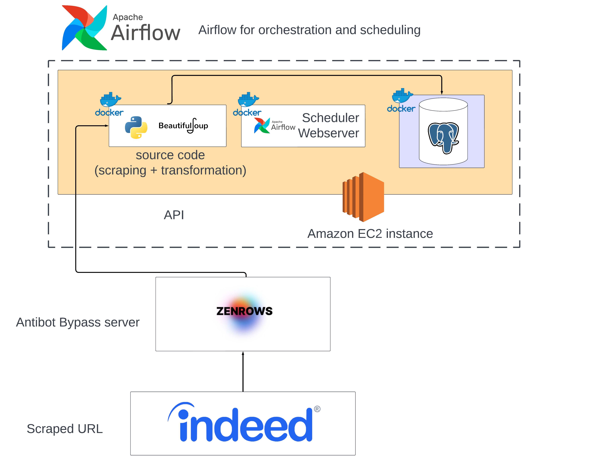
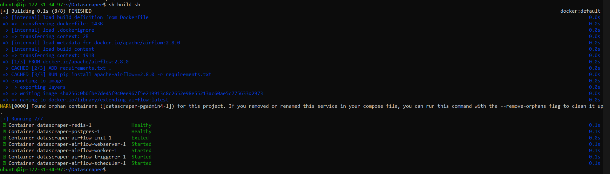
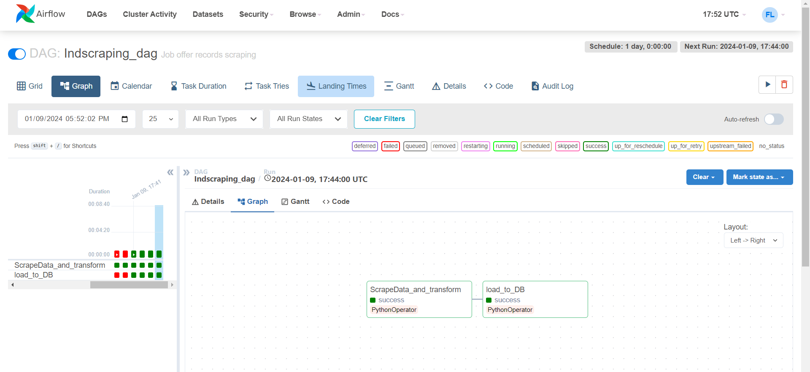
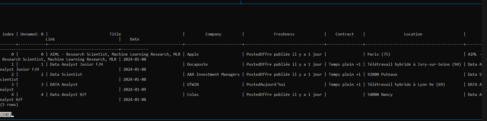

# Indeed Web Scraper


# Overview

This is a web scraper designed for Indeed job listings, utilizing a paid web proxy API. The application can be deployed using Docker Compose, extracting job information based on specified subjects and job freshness criteria and storing it in a PostgreSQL database.

## Why Use This Scraper?
Having a job offer database unlocks a multitude of options in your job search. Here are some of the things you can try:

### Job Market Insights
Analyze the job market tailored to your specific skills and target career. Gain powerful insights into market trends, skill demands, and company preferences.

### Personalized Job Search
Customize your job search to match your preferences by filtering based on technologies, skills, and languages. Enjoy a personalized job-hunting experience.

### Targeted Company Exploration
Zero in on opportunities aligned with your career goals by filtering job listings based on companies of interest.

### Automated Applications
Experience the convenience of automating job applications, streamlining the process for increased efficiency.


# Example Deployment on EC2 Ubuntu Instance



## Requirements

- Ensure your instance has sufficient compute resources (2vCPUs and 8GB RAM recommended).
- Allow inbound connections on port 8080 (Airflow web server) and port 5432 (PostgreSQL).
- Set up an `init_instance.sh` file, then execute it to start all containers.


## Initialization Script

```bash
#docker install->start
sudo apt update

sudo apt install -y apt-transport-https ca-certificates curl software-properties-common

curl -fsSL https://download.docker.com/linux/ubuntu/gpg | sudo gpg --dearmor -o /usr/share/keyrings/docker-archive-keyring.gpg

echo "deb [arch=amd64 signed-by=/usr/share/keyrings/docker-archive-keyring.gpg] https://download.docker.com/linux/ubuntu $(lsb_release -cs) stable" | sudo tee /etc/apt/sources.list.d/docker.list > /dev/null

sudo apt update

sudo apt install -y docker-ce docker-ce-cli containerd.io

sudo systemctl start docker

#docker-compose install
sudo curl -L https://github.com/docker/compose/releases/latest/download/docker-compose-$(uname -s)-$(uname -m) -o /usr/local/bin/docker-compose

sudo chmod +x /usr/local/bin/docker-compose

# Clone the code and create an .env file
git clone https://github.com/Booss3my/Datascraper.git
echo -e "AIRFLOW_UID=$(id -u)\n
AIRFLOW_GID=0\n
antibotbypass_API_KEY=0000this0is0a0fake0key0000\n
DB_USER=airflow\n
DB_PASS=airflow \n
DB_HOST=localhost\n
DB_NAME=indeed_scrape" > Datascraper/.env
cd Datascraper
sh build.sh
```
It should look something like this:







## Troubleshooting
If airflow-init breaks due to the absence of the "airflow" database in the PostgreSQL container:

Enter the PostgreSQL container:

```bash
docker exec -it datascraper_postgres_1 bash
```
Create the database:

```bash
createdb -h localhost -U airflow airflow
```

Exit the container (Ctrl+D) and ensure you're in the root folder.

Rerun the build script:

```bash
sh build.sh
```
